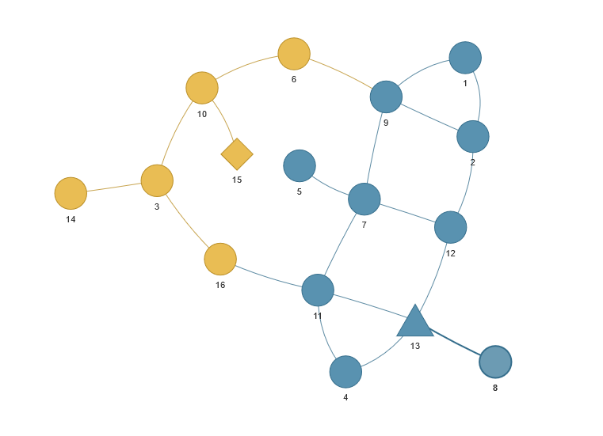

# Roguelite Room Generator


<a href="https://creativecommons.org/licenses/by-nc/4.0/"></a>

## Overview
The Roguelite Room Generator is a Python project that allows you to create interconnected rooms for roguelite games. It uses [Prüfer codes](https://en.wikipedia.org/wiki/Pr%C3%BCfer_sequence) to generate random fully connected graphs and employs [Spectral Clustering](https://en.wikipedia.org/wiki/Spectral_clustering) for splitting the graph into separate clusters, enabling a more sophisticated selection of start and end points within the generated graph.

I've used pyvis to visualize the result. It generates an HTML file which you can simply open with your web browser and  explore the proposed room.

## Features
- Random generation of connected rooms.
- Use of Prüfer codes to ensure full graph connectivity.
- Spectral clustering for dividing the graph into two clusters.
- Improved start and end point selection.
- Highly customizable parameters for room generation.

## Installation
### Prerequisites
Python 3.10.10
pyvis 0.3.2
scikit-learn 1.2.2
numpy 1.24.2

1. Clone the repository:

    ```bash
    git clone https://github.com/luiherch/nodes.git
    ```

2. Navigate to the project directory:

    ```bash
    cd nodes
    ```

3. Install Poetry (if not already installed):

   ```bash
   curl -sSL https://install.python-poetry.org | python3 -
   ```

4. Install the project dependencies using Poetry:

   ```bash
   poetry install
   ```

## Room Generator
The RoomGenerator object is able to create Room objects using the RoomGenerator.generate_room() method.
A single RoomGenerator can be used to generate multiple Rooms using the same configuration.

## Room
Room objects contain a network and can be visualized using Room.show() method. The triangle symbolizes the start node (entrance) and the diamond the end node (exit).



## Customization
Adjust the parameters in the roomgen_test.py file to customize the room generation process.
Modify the Prufer code generation or spectral clustering methods as needed.

## Contributing
I welcome contributions from the open-source community. If you'd like to contribute to this project, please follow these steps:

- Fork the repository.
- Create a new branch for your feature or bug fix.
- Make your changes and commit them.
- Submit a pull request.

## License
This project is licensed under the CC BY-NC 4.0 License. See the [LICENSE](LICENSE) file for more information.
